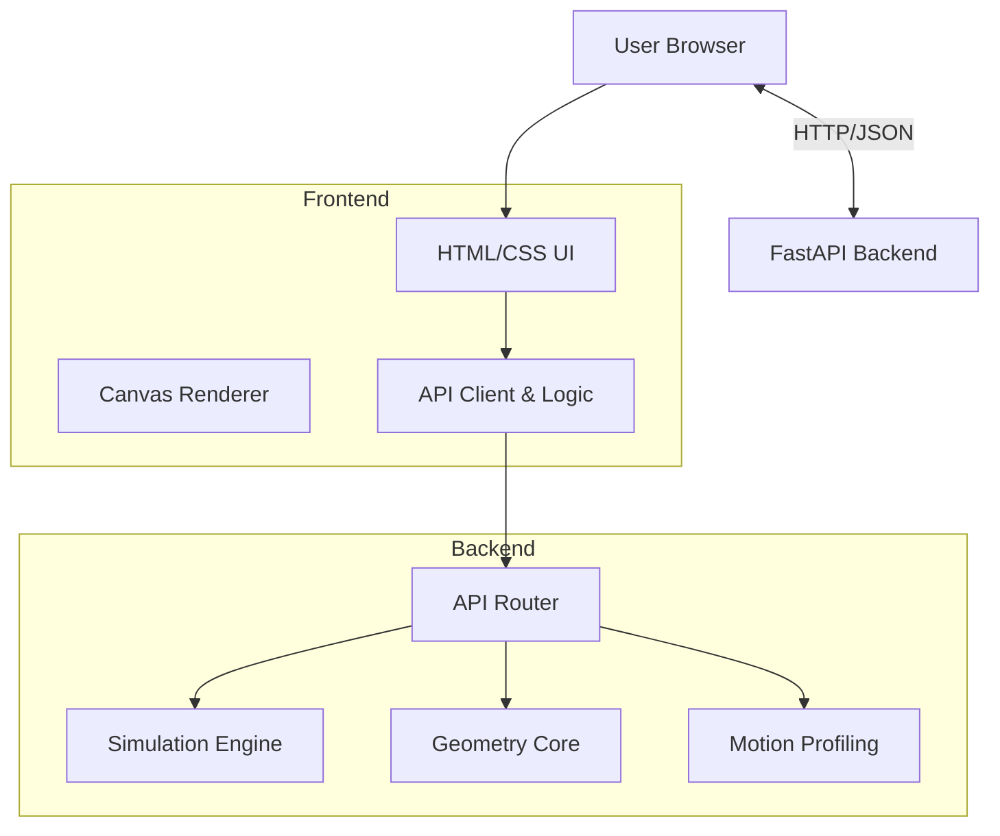

# Architecture Overview

The LTV Unicycle Path Planner uses a client-server architecture to separate the complex computational logic from the user interface.

## System Diagram

## Components

### Backend (`/backend`)

The backend is built with **FastAPI** and serves as the computational engine. It handles:

1. **Path Generation (`core/geometry.py`)**:
    - Calculates Cubic Bezier curves.
    - Computes derivatives for heading (theta) and curvature.
    - Discretizes curves into trajectory points.

2. **Motion Profiling (`core/motion.py`)**:
    - Generates velocity profiles based on physical constraints (Max Velocity, Acceleration, Jerk).
    - Supports Trapezoidal and S-Curve profiles.

3. **Simulation (`core/simulation.py`)**:
    - Maintains the state of a virtual robot.
    - Updates physics state based on time steps (`dt`).
    - Reset and Start logic.

### Frontend (`/frontend`)

The frontend is a **Vanilla JavaScript** application that handles visualization and user interaction:

- **Canvas Rendering**: Draws the field, path, control points, and robot avatar on an HTML5 Canvas.
- **State Management**: Keeps track of control point positions and simulation status.
- **API Integration**: Sends coordinates and constraints to the backend and renders the returned trajectory/profile.

## Data Flow

1. **Path Creation**: User moves a point -> Frontend sends points to `/api/path/generate` -> Backend returns full trajectory -> Frontend draws path.
2. **Simulation**: User clicks "Start" -> Frontend sends trajectory & profile to `/api/sim/start` -> Frontend polls `/api/sim/step` -> Backend calculates next pose -> Frontend updates robot position.
