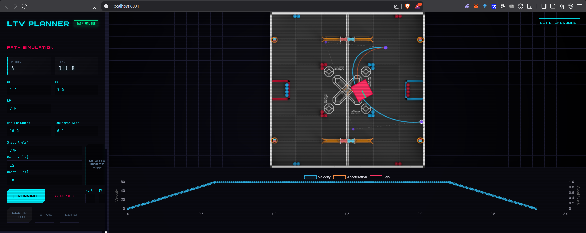

# LTV Unicycle Path Planner



A comprehensive path planning and motion profiling application for unicycle-model robots (e.g., differential drive). This project features a Python FastAPI backend for heavy computational geometry and physics simulation, coupled with a responsive interactive frontend for visualization and control.

## Features

- **Path Generation**: Create smooth paths using Cubic Bezier curves with adjustable control points.
- **Motion Profiling**: Generate Trapezoidal (limited acceleration) or S-Curve (limited jerk) motion profiles.
- **Simulation**: Visual 2D simulation of a robot following the generated path and profile.
- **Interactive UI**: Drag-and-drop control points, real-time feedback, and charts.

## Technology Stack

- **Backend**: Python 3.10+, FastAPI, NumPy, Uvicorn.
- **Frontend**: Vanilla JavaScript (ES6+), HTML5 Canvas, CSS3.
- **Deployment**: Docker, Docker Compose.

## quick Start

### Using Docker (Recommended)

1. Ensure you have Docker and Docker Compose installed.
2. Run the application:

    ```bash
    docker-compose up --build
    ```

3. Open your browser to `http://localhost:8001`.

### Local Development

1. **Backend Setup**:

    ```bash
    cd backend
    pip install -r requirements.txt
    uvicorn main:app --reload --port 8001
    ```

2. **Access**:
    The backend serves the frontend static files automatically. Open `http://localhost:8001` in your browser.

## Documentation

For more detailed information, please refer to the following documents:

- [Setup Guide](SETUP.md) - Detailed installation and development environment setup.
- [Architecture](ARCHITECTURE.md) - High-level overview of the system design and core logic.
- [API Reference](API.md) - Documentation of the HTTP API endpoints.
